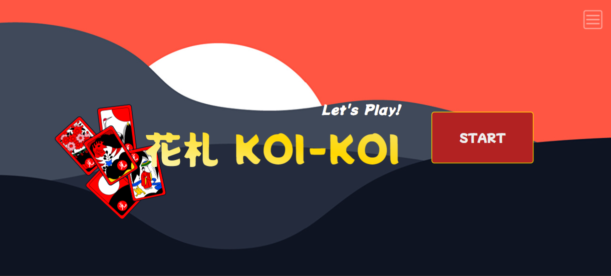

# Let's Play Koi-Koi
This is a Hanafuda game created using TypeScript, Vue.js, and Nuxt.js. Hanafuda is a traditional Japanese card game, also known as "flower cards". The objective of the game is to capture cards with matching symbols or create specific combinations of cards.

🎴[Click here to play!](https://lets-play-koikoi.vercel.app)🎴

## Gameplay
The game is played with a deck of 48 cards, each with a unique symbol.

The objective of the game is to capture cards with matching symbols or create specific combinations of cards. Each turn, players draw a card from the deck and play a card from their hand. If a player captures a card with a matching symbol, they can play another card. The game ends when the deck is depleted and all players have played their cards.

## Technologies Used

- TypeScript
- Vue.js
- Nuxt.js

## License
This project is licensed under the MIT License. See the LICENSE file for details.